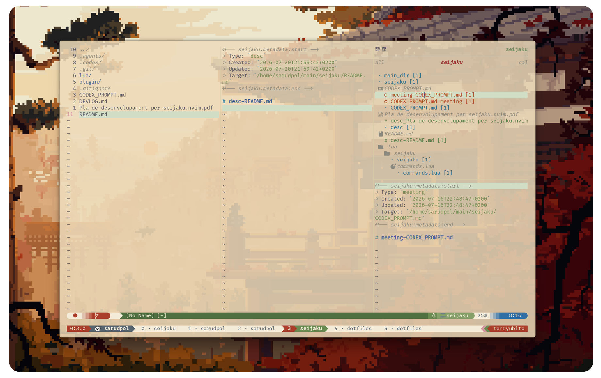
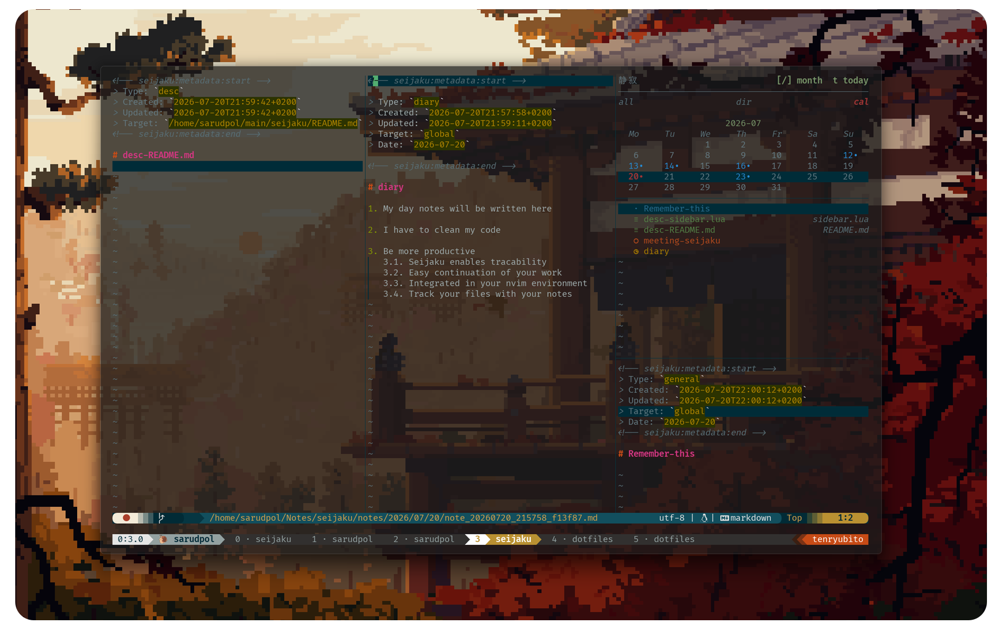

# 静寂 seijaku.nvim

> A quiet, filesystem-aware Markdown notebook for Neovim.

`seijaku.nvim` keeps notes close to the files, directories and dates they
belong to. It uses real Neovim splits, a small JSON index and ordinary Markdown
files—no database, web view or proprietary format.



<!-- ```text -->
<!-- 静寂                         sort date | filter all -->
<!-- ──────────────────────────────────────────────── -->
<!-- date                     dir                     cal -->
<!---->
<!--  2026-07-16 -->
<!--    · project notes                     README.md -->
<!--    ◷ diary -->
<!--    ○ meeting-api                         api.lua -->
<!--    ≡ desc_config                        config.lua -->
<!-- ``` -->

## ◆ Highlights

- Four views: global index, filesystem context, todos and calendar.
- Notes attach to any file or directory, including images, video and office
  documents.
- Four note types with independent color, icon and filtering.
- Calendar scheduling independent from creation and modification dates.
- Dynamic preview plus additional managed note splits.
- Adaptive docked and standalone layouts.
- Live synchronization between Neovim instances sharing a vault.
- Soft-wrapped Markdown and compact generated metadata.
- Oil and netrw filesystem contexts, plus scoped Telescope live grep.



## ↓ Install

### Lazy.nvim / LazyVim

Create `~/.config/nvim/lua/plugins/seijaku.lua`:

```lua
return {
  {
    "saruDpol/seijaku-nvim",
    main = "seijaku",
    lazy = false,
    opts = {
      vault_dir = "~/Notes/seijaku",
      sidebar = {
        width = "auto",
        standalone_layout = "vertical",
        default_mode = "all",
        default_all_sort = "date",
        default_all_filter = "all",
      },
      editor = {
        wrap = true,
        linebreak = true,
        breakindent = true,
      },
      keymaps = {
        enable_default = true,
        toggle = "<A-o>",
        new_for_current = "<leader>a",
      },
    },
  },
}
```

Restart Neovim and run `:Lazy sync`. Lazy calls
`require("seijaku").setup(opts)` automatically.

### Local checkout

For a local clone or active development, point Lazy directly at the directory:

```lua
return {
  {
    dir = "/absolute/path/to/seijaku",
    name = "seijaku.nvim",
    main = "seijaku",
    lazy = false,
    opts = {
      vault_dir = "~/Notes/seijaku",
    },
  },
}
```

Edits are visible directly; no `:Lazy sync` is required. Restart Neovim after
changing Lua code so cached modules are loaded again.

Without a plugin manager, place or symlink the repository under a native
package path and call setup from `init.lua`:

```text
~/.local/share/nvim/site/pack/dev/start/seijaku.nvim
```

```lua
require("seijaku").setup({
  vault_dir = "~/Notes/seijaku",
})
```

## ◇ Notes

Creating a note first opens a one-key type selector—pressing `1`–`4` accepts
immediately; `Esc` cancels.

| Key | Type        | Mark | Suggested title              |
| --- | ----------- | :--: | ---------------------------- |
| `1` | General     | `·`  | Current target or `Untitled` |
| `2` | Diary       | `◷`  | `diary`                      |
| `3` | Meeting     | `○`  | `meeting-<filename>`         |
| `4` | Description | `≡`  | `desc-<filename>`            |

General, diary, meeting and description rows use dark Japanese-inspired blue,
gold, orange and Seijaku green. Existing notes without a stored type remain
general.

Every new note starts with a small generated header before its title:

```markdown
<!-- seijaku:metadata:start -->

> Type: `meeting`
> Created: `2026-07-16T18:30:00`
> Updated: `2026-07-16T18:30:00`
> Target: `/project/api.lua`
> Date: `2026-07-18`

<!-- seijaku:metadata:end -->

# meeting-api.lua
```

The header stays synchronized when metadata changes. `index.json` remains the
source of truth; Seijaku does not parse Markdown to rebuild operational state.

## ⌁ Sidebar

Open it with `Alt-o` or `:SeijakuToggle`. The default view is `all`.

| Key     | Action                                                           |
| ------- | ---------------------------------------------------------------- |
| `Enter` | Open a note, toggle a todo, or enter the calendar day list       |
| `a`     | Create a contextual note; create a todo in `todo`                 |
| `n`     | Create a global note; create a todo in `todo`                     |
| `r`     | Rename the selected note or todo                                 |
| `dd`    | Delete the selected note or todo                                 |
| `x`     | Detach the current target; clear a calendar date in the day list |
| `Tab`   | Cycle `all → directory → todo → calendar`                        |
| `s`     | Cycle `date → updated → created` sorting in `all`                |
| `f`     | Cycle note types in `all`; cycle `all/open/closed` in `todo`     |
| `/`     | Live grep the notes in the current `all` or `directory` scope    |
| `T`     | Create a todo for the selected day in `calendar`                 |
| `R`     | Refresh                                                          |

The green text in the top-right header is contextual: sort/filter state in
`all`, `[/] month  t today` in `calendar`, and the Seijaku label in
`directory`; todo mode shows its create/toggle reminder.

### all

- `date`: groups by calendar date, falling back to creation date.
- `updated`: sorts by the last content or metadata update.
- `created`: groups strictly by creation day.
- `f`: independently cycles `all`, `general`, `diary`, `meeting` and `desc`.

Sorting and filtering combine freely. The first associated target appears on
the right of each row. `/` searches note contents after applying the active
type filter, so `filter meeting` searches only meeting notes.

### directory

For a file, the view shows notes attached exactly to that file. For a directory,
Oil buffer or netrw buffer, it renders a filtered recursive tree containing
annotated paths and the intermediate directories needed to reach them.

In Oil and local netrw, the entry under the cursor is used for association
actions; the view itself continues to represent the open directory and its
descendants. Any real filesystem file is a valid target regardless of extension
or file type. Remote netrw URLs are intentionally not treated as local targets.

`/` searches only notes attached to the current file, or to the current
directory and its descendants. Search is deliberately unavailable in calendar
mode. It requires `telescope.nvim` and `rg`; selecting a match opens the note in
Seijaku's managed preview and jumps to the matching line.

Deleting or moving a target never deletes its notes. The stored association is
kept at the old path and rendered with a warning-colored `!` in `all`,
`directory` and `calendar`. Automatic relinking is intentionally left to the
user for now, because a new path cannot be inferred safely in every case.

### todo

Todos are lightweight indexed items, not Markdown files, so they never open or
replace a preview. They retain their creation timestamp and are grouped by an
explicit calendar date, falling back to their creation day:

```text
 2026-07-20
   □ Review documentation          created 2026-07-20
   ■ Prepare release                closed 2026-07-20
```

Use `n` (or `a`) to create one, `Enter` to complete or reopen it, `r` to edit
its text, `dd` to delete it and `f` to cycle `all`, `open` and `closed`.
Todos use minimal empty/filled box icons aligned with the note-icon column.
Open items use sakura pink; closed text returns to a neutral grey and is struck
through. Their metadata changes from `created` to `closed`, using
the completion date. Long text occupies continuation lines instead of being
trimmed with `...`. Newer dates and newer items appear first. Moving into or
through this mode preserves the current preview and managed layout.

### calendar

The Gregorian calendar renders any month from year 1 through 9999. `YYYY-MM`
uses Seijaku green; the selected day uses the active-mode red. Days containing
notes are marked.

| Key          | Calendar action                      |
| ------------ | ------------------------------------ |
| `h/l`, `←/→` | Previous/next day                    |
| `j/k`, `↓/↑` | Next/previous week                   |
| `[/]`        | Previous/next month                  |
| `gg/G`       | First/last day of the month          |
| `t`          | Today                                |
| `Enter`      | Focus the items for the selected day |

Calendar and day items are separate navigable windows. The calendar always
renders a fixed six-week grid; shorter months leave trailing cells empty, so
changing month never resizes the panel. `T` creates a todo for the selected day. `Enter` toggles a selected
todo; selecting one never changes the preview. Moving through day notes updates
the managed preview. A day without a previewable note keeps the current preview
and layout unchanged.

Notes created here receive an explicit `calendar_date`. Notes without one
appear on their creation day; `x` clears an explicit date and restores that
fallback.

## ▦ Layouts

With a normal editor window, Seijaku is docked on the side. In `all` and
`directory`, its list, preview and additional notes share the sidebar column
evenly. Closing the dynamic preview promotes the most recently opened managed
note window to that role.

When no meaningful external window remains and
`sidebar.standalone_layout = "vertical"`, notes become full-height columns to
the left of the sidebar:

```text
┌──────────────┬──────────────┬─────────────┐
│ dynamic note │ fixed note   │ sidebar     │
└──────────────┴──────────────┴─────────────┘
```

Calendar keeps its two internal panels on the right:

```text
┌─────────────────────────────┬─────────────┐
│                             │ calendar    │
│ dynamic note                ├─────────────┤
│                             │ day notes   │
└─────────────────────────────┴─────────────┘
```

Window ownership is explicit. Sidebar panels and notes opened by Seijaku are
managed; manual splits and windows created by other plugins are external—even
if they show the same note buffer. Seijaku never reuses or resizes those
external windows, and creating one during a standalone session causes no
surprise reflow.

Changing modes, selecting an empty directory/day/filter, or moving through the
calendar never consumes existing standalone note columns.

## ⌨ Commands

```vim
:SeijakuToggle
:SeijakuOpenSidebar
:SeijakuCloseSidebar
:SeijakuModeAll
:SeijakuModeDirectory
:SeijakuModeTodo
:SeijakuModeCalendar
:SeijakuToggleMode
:SeijakuNew
:SeijakuTodo
:SeijakuNewForCurrent
:SeijakuNewForPath {path}
:SeijakuAttachPath {note_id} {path}
:SeijakuDetachPath {note_id} {path}
:SeijakuOpen {note_id}
:SeijakuList
:SeijakuRebuildIndex
:SeijakuReconcile
:SeijakuGrep
```

`:SeijakuReconcile` compares `notes/` with `index.json`: it imports orphaned
Markdown files, removes index entries whose note file disappeared, and handles
notes moved inside the vault in one pass. It does not remove notes merely
because an associated external target is missing. If two Markdown files declare
the same `note_id`, reconciliation reports both paths and leaves that ID
unchanged instead of choosing one copy and risking data loss. Todos live only
in the atomic index and are never modified by reconciliation.

Default global mappings:

```text
Alt-o       toggle the sidebar
<leader>a  create a note for the current buffer, Oil entry or netrw entry
```

Set either mapping to `false`, or use `keymaps.enable_default = false`, to
disable the defaults.

## ⚙ Configuration

```lua
require("seijaku").setup({
  vault_dir = "~/Notes/seijaku",
  sidebar = {
    width = "auto",                 -- bounded between 44 and 56
    position = "right",
    standalone_layout = "vertical", -- use another value to stay docked
    default_mode = "all",
    default_all_sort = "date",
    default_all_filter = "all",
    default_todo_filter = "all",
    all_mode_limit = 500,
    debounce_ms = 150,
  },
  editor = {
    open_cmd = "belowright split",
    wrap = true,
    linebreak = true,
    breakindent = true,
  },
  keymaps = {
    enable_default = true,
    toggle = "<A-o>",
    new_for_current = "<leader>a",
  },
  integrations = {
    oil = true,
    netrw = true,
    telescope = true,
  },
  index = {
    save_debounce_ms = 500,
    reload_debounce_ms = 120,
    lock_timeout_ms = 2000,
    stale_lock_ms = 10000,
    watch_external_changes = true,
  },
})
```

Wrapping is window-local and visual: long Markdown lines continue on screen
without inserting newline characters or affecting Markdown buffers outside
Seijaku.

Instances sharing a vault watch atomic replacements of `index.json`. External
changes are reloaded after a short debounce and refresh an open sidebar. Writes
take a short filesystem lock, reload the latest index and merge only local
per-note and per-todo upserts/deletes before replacing the file atomically;
stale instances therefore cannot overwrite unrelated changes from another
Neovim process.

## □ Vault

```text
~/Notes/seijaku/
├── index.json                  # note metadata, targets and lightweight todos
├── notes/
│   └── YYYY/MM/DD/<note_id>.md
└── backups/
    ├── canonical/
    └── snapshots/
```

- Notes are ordinary Markdown files.
- IDs are independent from filesystem paths.
- A note can target many paths; a path can have many notes.
- Notes can remain global without any target.

## License

Copyright © 2026 saruDpol.

Licensed under the [Apache License 2.0](LICENSE).
See the [NOTICE](NOTICE) file for attribution information.
