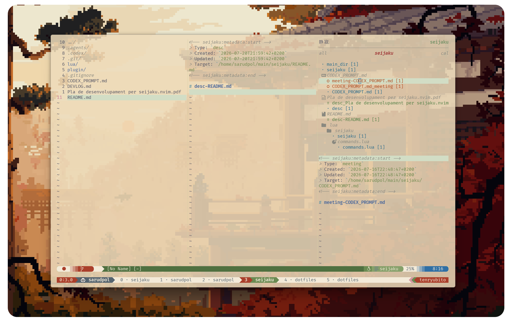

# 静寂 seijaku.nvim

> A quiet, filesystem-aware Markdown notebook for Neovim.

Seijaku is a local, keyboard-first notebook built from ordinary Markdown,
native Neovim windows and one small JSON index.



## ◆ Highlights

- Markdown notes in a local vault.
- Pinned notes, coloured tags and project notebooks with configurable icons.
- Optional file and directory targets.
- Calendar view with day scheduling.
- One persistent Markdown preview.
- Telescope live grep.
- Oil and netrw context support.
- Atomic index writes and external reloads.
- No database, web view or standalone todo model.

## ↓ Install

### lazy.nvim / LazyVim

```lua
return {
  {
    "saruDpol/seijaku-nvim",
    main = "seijaku",
    lazy = false,
    opts = {
      vault_dir = "~/Notes/seijaku",
      sidebar = {
        width = "auto",
        preview_width = 24, -- opening width: columns, or a fraction such as 0.2
        default_mode = "all",
        default_all_sort = "updated",
      },
    },
  },
}
```

### Local checkout

```lua
return {
  {
    dir = "/absolute/path/to/seijaku-nvim",
    name = "seijaku.nvim",
    main = "seijaku",
    lazy = false,
    opts = { vault_dir = "~/Notes/seijaku" },
  },
}
```

## ◇ Notes

`n` opens the note composer. A note has:

- title
- template
- notebook
- tags
- optional calendar date
- optional file or directory targets

Notes are plain Markdown. Metadata lives in `index.json`; the document body
stays yours.

### Path picker

The same picker is used for note targets and notebook working directories.

| Key       | Action                                  |
| --------- | --------------------------------------- |
| `j` / `k` | Move                                    |
| `h`       | Parent directory                        |
| `l`       | Enter directory                         |
| `Space`   | Select / clear path                     |
| `Enter`   | Continue with selected path, or no path |
| `Esc`     | Cancel                                  |

## ⌁ Sidebar

Open with `<A-o>` or `:SeijakuToggle`.

| Key                 | Action                              |
| ------------------- | ----------------------------------- |
| `j` / `k`           | Move between notes                  |
| `Enter`             | Focus the persistent preview        |
| `n`                 | New note                            |
| `a`                 | Attach a target                     |
| `O`                 | Replace the current target          |
| `r`                 | Rename                              |
| `dd`                | Delete                              |
| `p`                 | Pin / unpin                         |
| `T`                 | Edit tags and tag icons             |
| `N`                 | Assign or clear a notebook          |
| `o`                 | Open target in Oil                  |
| `s`                 | Cycle sort order                    |
| `Tab` / `Shift-Tab` | Cycle notebooks and no-filter state |
| `f` / `F`           | Cycle tags                          |
| `/`                 | Filter notes                        |
| `g/`                | Telescope live grep                 |
| `C`                 | Toggle calendar                     |

The first entry in both selector panels is `○`: no notebook or no tag filter.
When active it becomes `●`, with accent colour and bold text.
The notebook assignment popup marks the note's current notebook with its
coloured background. In the tag assignment popup, `r` changes the highlighted
tag's icon. In the tag selector panel, `r` edits a tag's name, icon and colour;
`n` creates a new tag with the same attributes. From either selector panel,
`dd` deletes the selected notebook or tag after confirmation; notes are kept.

`preview_width` sets the preview's opening width in the normal layout. It accepts
columns or a fraction of the editor width (`0.2` = 20%). The preview remains
resizable afterwards; the note list and selector column stay fixed.

The sidebar renders compact cards with title, creation date, notebook, tags and
targets. The preview and its header are one component: closing either closes
both. Unsaved Markdown buffers are kept safely hidden.

## ⌘ Calendar

`:SeijakuModeCalendar` opens the calendar. Notes can be assigned an explicit
date; otherwise they appear on their creation date.

| Key       | Action                 |
| --------- | ---------------------- |
| `h` / `l` | Previous / next day    |
| `j` / `k` | Previous / next week   |
| `[` / `]` | Previous / next month  |
| `t`       | Today                  |
| `0`–`9`   | Jump to a day          |
| `Enter`   | Open the selected note |

## → Commands

```text
:SeijakuToggle
:SeijakuFull
:SeijakuOpenSidebar
:SeijakuCloseSidebar
:SeijakuModeAll
:SeijakuModeCalendar
:SeijakuNew
:SeijakuNewForCurrent
:SeijakuNewForPath {path}
:SeijakuNotebook
:SeijakuOpen {note-id}
:SeijakuAttachPath {note-id} {path}
:SeijakuDetachPath {note-id} {path}
:SeijakuRebuildIndex
:SeijakuReconcile
:SeijakuList
:SeijakuGrep
```

## ⌁ Vault

```text
~/Notes/seijaku/
├── notes/
│   └── YYYY/MM/DD/*.md
└── index.json
```

The index is written atomically and watched by other Neovim instances.
`SeijakuReconcile` imports Markdown files added outside Seijaku.
